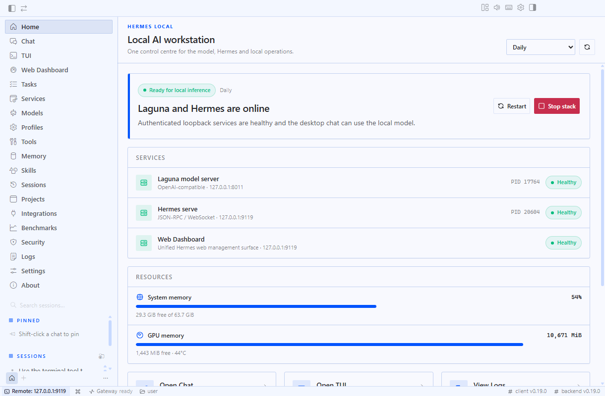
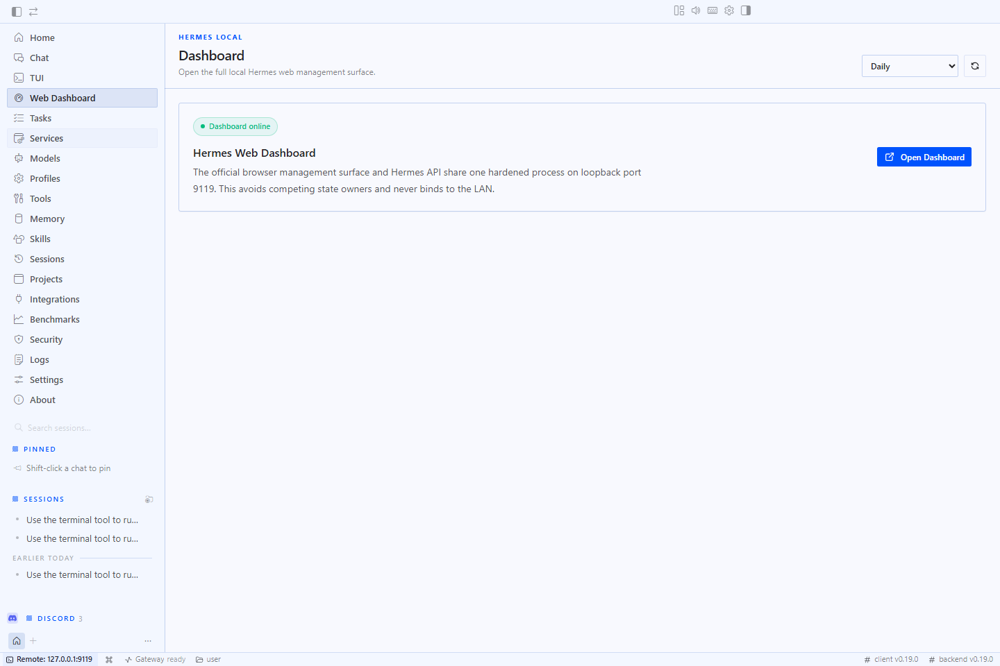
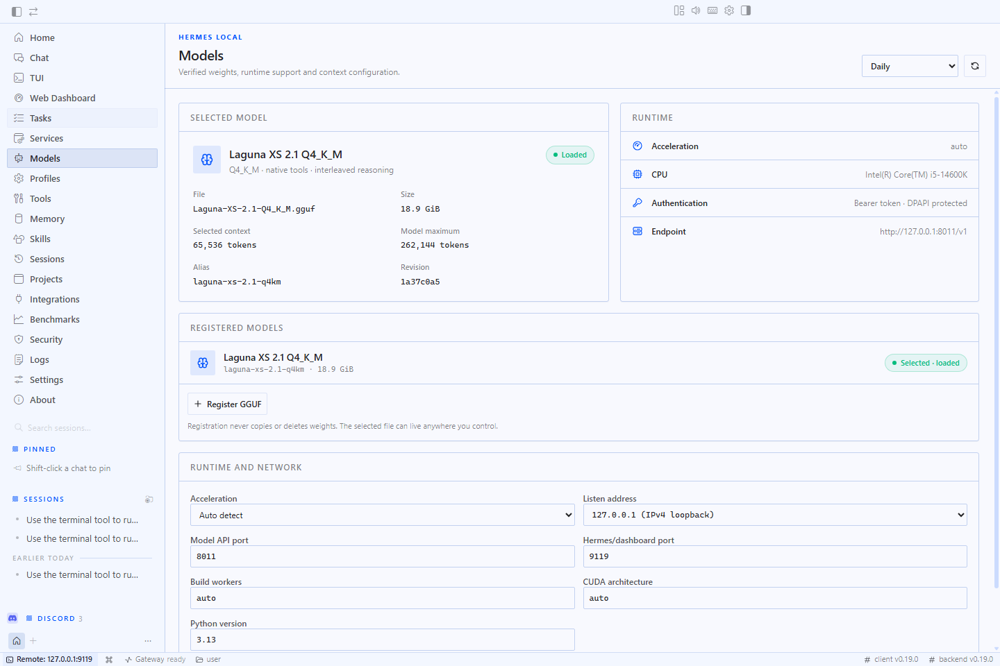
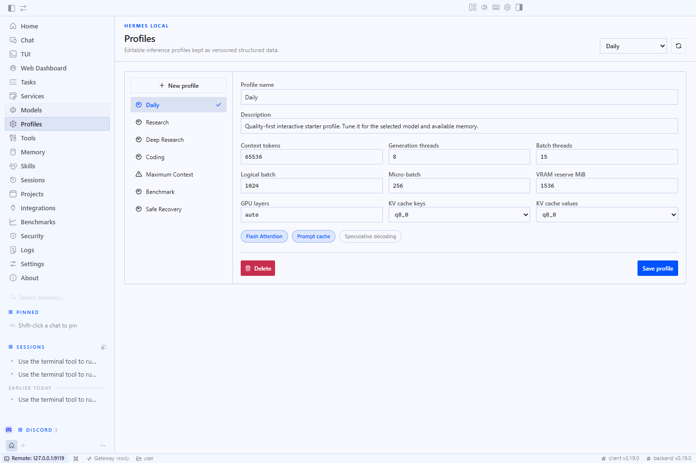
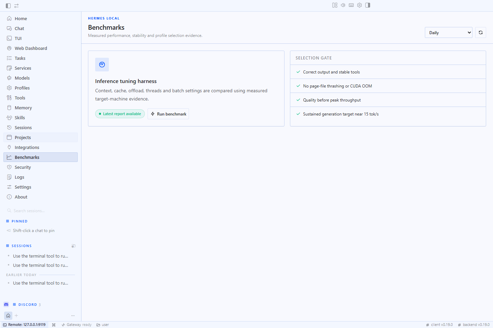
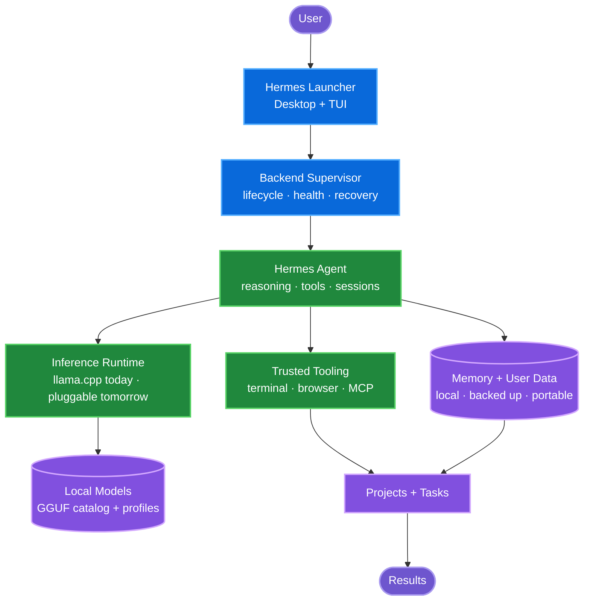

<div align="center">

# Hermes Local

### Frontier-quality local AI, engineered for the Windows hardware you already own.

Hermes Local turns a consumer PC into a private AI workstation for running, tuning,<br>
benchmarking and orchestrating local models—without Docker, WSL or a paid inference API.

[**Download**](https://github.com/xdCloudy/Hermes-Local/releases/latest) ·
[**Install**](#install) ·
[**Explore the docs**](docs/README.md) ·
[**View the roadmap**](#roadmap) ·
[**Contribute**](CONTRIBUTING.md)

[](https://github.com/xdCloudy/Hermes-Local/releases/latest)
[](LICENSE)
[](docs/INSTALLATION.md)
[](docs/INSTALLATION.md)

[](https://github.com/xdCloudy/Hermes-Local/actions/workflows/powershell-validation.yml)
[](https://github.com/xdCloudy/Hermes-Local/actions/workflows/update-readme.yml)
[](https://github.com/xdCloudy/Hermes-Local/releases)
[](https://github.com/xdCloudy/Hermes-Local/issues)
[](https://github.com/xdCloudy/Hermes-Local/issues?q=is%3Aissue+is%3Aclosed)
[](https://github.com/xdCloudy/Hermes-Local/stargazers)
[](https://github.com/xdCloudy/Hermes-Local/commits/main)

> [!NOTE]
> Hermes Local is an independent Windows integration built on the official
> [NousResearch Hermes Agent](https://github.com/NousResearch/hermes-agent).
> It is not an official Nous Research release.

</div>



## At a glance

<!-- BEGIN GENERATED STATUS -->
| Release | Delivery | Repository |
|---|---|---|
| **Current build:** v0.18.3<br>**Latest release:** [v0.18.1](https://github.com/xdCloudy/Hermes-Local/releases/tag/v0.18.1)<br>**Recent release:** Hermes Local v0.18.1 — Cold-start reliability · 2026-07-28 | **Current milestone:** [v0.18.x – Reliability Patch](https://github.com/xdCloudy/Hermes-Local/milestone/5)<br>**Current focus:** Remove fatal and opaque failure modes before expanding the control plane.<br>**Next:** Operational Control Plane | **Issues:** 47 open · 6 closed<br>**Overall completion:** 11%<br>**Recent commit:** [`a606814`](https://github.com/xdCloudy/Hermes-Local/commit/a606814ca1eb93bc5ac01ac850b541e1c2dc0ddb) docs: refresh project dashboard |

> Status is generated from GitHub issues, milestones, releases and commits.
<!-- END GENERATED STATUS -->

## Why Hermes Local

Local AI is often presented as a model picker and a start button. The difficult
part begins after launch: matching a model and runtime to the machine, managing
RAM and VRAM, proving an optimisation helps, recovering from failures, and
keeping the whole system understandable.

Hermes Local treats those problems as the product.

| | What that means |
|---|---|
| **Windows first** | A native launcher, PowerShell lifecycle, Windows Job Objects, DPAPI-protected credentials and paths that work on any drive. |
| **Hardware aware** | Profiles and planned AutoTune account for CPU, GPU, RAM, VRAM, pagefile, context and workload—not just a model name. |
| **Evidence led** | Benchmarks measure speed, memory, quality, tool use, long context and stability. Optimisations must be measurable and reversible. |
| **Operationally complete** | Setup, health, logs, diagnostics, backup, repair, update, rollback and uninstall belong to one workstation lifecycle. |
| **Built to experiment** | Runtimes and research techniques can be integrated, compared and certified before they become dependable defaults. |
| **Private by default** | Services bind to loopback, model weights remain local, and no paid inference API is required. |

The North Star is deliberately ambitious: **make the most capable private AI
practical and interactive on ordinary consumer hardware**. Useful capability
matters more than a headline tokens-per-second number; tool calling, structured
output, reasoning, context and stability are part of performance.

## What works today

| Area | Capability | Status |
|---|---|:---:|
| Launcher | Native desktop control centre and integrated Hermes TUI | ✅ |
| Inference | llama.cpp CPU/CUDA serving with loopback-only authenticated endpoints | ✅ |
| Models | Portable GGUF catalog, local registration, selection and starter manifest | ✅ |
| Profiles | Context, KV cache, threads, batching, offload, Flash Attention and prompt caching | ✅ |
| Benchmarks | Reproducible throughput, context, memory, quality and tool-use evidence | ✅ |
| Diagnostics | Health checks, structured logs, privacy-reviewed support bundles and repair | ✅ |
| Security | DPAPI token protection, process isolation, threat model, scans and SBOMs | ✅ |
| Automation | Setup, start/stop, update, rollback, backup/restore, package and QA scripts | ✅ |
| Projects | Project, session, task and tool surfaces in Hermes Launcher | ✅ |
| Memory | Local user-owned state, backup and restore; deeper workspace memory is planned | 🚧 |
| Networking | Local authenticated gateway; secure paired remote access is planned | 🚧 |
| Future | Multi-backend routing, certification, AutoTune and intelligent orchestration | ⏳ |

[See the detailed free/local feature matrix →](docs/FREE_FEATURE_MATRIX.md)

## See it in action

<table>
  <tr>
    <td width="50%"><br><strong>Dashboard</strong> — workstation health and resource state.</td>
    <td width="50%"><br><strong>Models</strong> — register, select and inspect local GGUF models.</td>
  </tr>
  <tr>
    <td width="50%"><br><strong>Profiles</strong> — tune context, cache, compute and offload policy.</td>
    <td width="50%"><br><strong>Benchmarks</strong> — turn performance claims into repeatable evidence.</td>
  </tr>
</table>

[Browse the complete screenshot catalog →](docs/SCREENSHOTS.md)

## Roadmap

The roadmap is capability-based, not date-based. Each stage creates the
contracts and evidence needed by the next.

<!-- BEGIN GENERATED ROADMAP -->
| Stage | Purpose and success criteria | GitHub milestones | Progress |
|---|---|---|---:|
| ✅ **Foundation** | **Purpose:** Establish a secure, portable Windows workstation around Hermes Agent and llama.cpp.<br>**Success:** Native launcher, local inference, profiles, diagnostics, recovery, benchmarks and security controls are validated. | [Dependable Installation and Maintenance](https://github.com/xdCloudy/Hermes-Local/milestone/1) | **100%**<br>1/1 issues |
| 🚧 **Reliable Platform** | **Purpose:** Remove fatal and opaque failure modes before expanding the control plane.<br>**Success:** Cold starts, lifecycle transitions and recovery paths fail clearly and recover predictably. | [v0.18.x – Reliability Patch](https://github.com/xdCloudy/Hermes-Local/milestone/5) | **75%**<br>3/4 issues |
| ⏳ **Operational Control Plane** | **Purpose:** Make every long-running workstation operation observable, durable and recoverable.<br>**Success:** Shared task state, update orchestration, focused operational surfaces and failure-path evidence. | [v0.19 – Operational Control Plane](https://github.com/xdCloudy/Hermes-Local/milestone/6) | **0%**<br>0/13 issues |
| ⏳ **Inference Fabric** | **Purpose:** Create stable contracts for multiple inference runtimes, planning, telemetry and certification.<br>**Success:** Backends can be compared, selected and recovered through one hardware-aware orchestration layer. | [Inference Fabric Foundation](https://github.com/xdCloudy/Hermes-Local/milestone/8) | **0%**<br>0/7 issues |
| ⏳ **Intelligent Optimisation** | **Purpose:** Turn hardware telemetry and benchmark evidence into safe, workload-specific tuning.<br>**Success:** AutoTune improves useful capability, speed or memory use without silently degrading quality or stability. | [Performance, AutoTune and Observability](https://github.com/xdCloudy/Hermes-Local/milestone/2) | **Planned** |
| ⏳ **Agent Ecosystem** | **Purpose:** Expand trusted tools, memory, projects, routing and experimental integrations.<br>**Success:** New capabilities are permission-scoped, reproducible and promoted through measurable certification gates. | [Certification, Routing and Recovery](https://github.com/xdCloudy/Hermes-Local/milestone/3)<br>[Expansion, Security and Advanced Optimisation](https://github.com/xdCloudy/Hermes-Local/milestone/4) | **Planned** |
| 🎯 **Version 1.0** | **Purpose:** Deliver a dependable Windows distribution suitable for supported non-technical users.<br>**Success:** Guided install, verified runtimes, signing, provenance, maintenance and data-preserving recovery are release-ready. | [v1.0 – Dependable Windows Distribution](https://github.com/xdCloudy/Hermes-Local/milestone/7) | **0%**<br>0/5 issues |

Progress is derived from issue counts on the linked milestones. The sequence is intentional; dates are added only when maintainers have a credible delivery window.
<!-- END GENERATED ROADMAP -->

[Open the GitHub Project](https://github.com/users/xdCloudy/projects/1) ·
[Browse roadmap issues](https://github.com/xdCloudy/Hermes-Local/issues) ·
[Read the planning model](docs/PROJECT-VIEWS.md)

## Architecture



The launcher and supervisor are the Windows-native product layer. Hermes Agent
remains the agent core; inference runtimes, model profiles and local services
are integrated behind explicit process, authentication and data boundaries.

[Explore the architecture and trust boundaries →](docs/ARCHITECTURE.md)

## Install

### Requirements

- Windows 10 or Windows 11 x64
- PowerShell 7
- About 16 GiB free before model weights
- Visual Studio 2022 C++ Build Tools for the bundled llama.cpp build
- Optional NVIDIA GPU, current driver and CUDA Toolkit for CUDA acceleration

Open a normal, **non-elevated** PowerShell 7 window:

```powershell
git clone https://github.com/xdCloudy/Hermes-Local.git
Set-Location .\Hermes-Local
& '.\Setup-Hermes-Local.ps1' -NonInteractive
```

Setup reconstructs the pinned Hermes integration, installs project-managed
dependencies, builds llama.cpp for the selected acceleration mode, optionally
downloads a starter model, writes the provider configuration and runs bootstrap
diagnostics. Downloads resume safely when setup is rerun.

Prefer a packaged launcher? Get the
[latest Windows release](https://github.com/xdCloudy/Hermes-Local/releases/latest).
Release binaries contain the control centre—not model weights or provisioned
runtimes—and are currently not Authenticode-signed. Verify the published
SHA-256 values before running them.

[Installation options, CPU/CUDA selection and custom models →](docs/INSTALLATION.md)

## Quick start

```powershell
# Start the selected model, inference profile and Hermes services
& '.\Start-Hermes-Local.ps1' -NonInteractive

# Open the desktop control centre
& '.\dist\Hermes Launcher.exe'

# Verify or stop the workstation
& '.\Test-Hermes-Local.ps1' -NonInteractive
& '.\Stop-Hermes-Local.ps1' -NonInteractive
```

The default endpoints are `http://127.0.0.1:8011/v1` and
`http://127.0.0.1:9119`. Both are configurable and remain restricted to IPv4
or IPv6 loopback.

<details>
<summary><strong>Choose a profile for one start</strong></summary>

```powershell
& '.\Start-Hermes-Local.ps1' -Profile 'Coding' -NonInteractive
```

Omit `-Profile` to use the current launcher selection.

</details>

<details>
<summary><strong>Maintenance command reference</strong></summary>

| Action | Command |
|---|---|
| Restart | `& '.\Restart-Hermes-Local.ps1' -NonInteractive` |
| Repair | `& '.\Repair-Hermes-Local.ps1' -NonInteractive` |
| Backup | `& '.\Backup-Hermes-Local.ps1' -Name manual -NonInteractive` |
| Check updates | `& '.\Update-Hermes-Local.ps1' -Mode Check -NonInteractive` |
| Update Hermes Agent | `& '.\Update-Hermes-Agent.ps1' -Mode Apply` |
| Roll back Hermes Agent | `& '.\Update-Hermes-Agent.ps1' -Mode Rollback` |
| Security scan | `& '.\Security-Scan-Hermes-Local.ps1' -NonInteractive` |
| Diagnostics | `& '.\Export-Hermes-Diagnostics.ps1' -NonInteractive` |
| Full functional QA | `& '.\scripts\qa\Invoke-FullFunctionalQA.ps1' -Scope Full` |

[Read the complete operations guide →](docs/OPERATIONS.md)

</details>

## Documentation

| Start here | Build and operate | Evidence and governance |
|---|---|---|
| [Documentation home](docs/README.md) | [Installation](docs/INSTALLATION.md) | [Acceptance results](docs/ACCEPTANCE_RESULTS.md) |
| [User guide](docs/USER_GUIDE.md) | [Models and profiles](docs/MODEL_TUNING.md) | [Security model](docs/SECURITY.md) |
| [Architecture](docs/ARCHITECTURE.md) | [Update and rollback](docs/UPDATE_AND_ROLLBACK.md) | [Roadmap views](docs/PROJECT-VIEWS.md) |
| [Feature matrix](docs/FREE_FEATURE_MATRIX.md) | [Troubleshooting](docs/TROUBLESHOOTING.md) | [Development](docs/DEVELOPMENT.md) |

## Contributing

Contributions are welcome across Windows engineering, inference optimisation,
benchmarking, UX, documentation and testing.

1. Read the [contributor guide](CONTRIBUTING.md) and
   [development setup](docs/DEVELOPMENT.md).
2. Choose a
   [good first issue](https://github.com/xdCloudy/Hermes-Local/issues?q=is%3Aissue+is%3Aopen+label%3A%22good+first+issue%22)
   or a [help-wanted task](https://github.com/xdCloudy/Hermes-Local/issues?q=is%3Aissue+is%3Aopen+label%3A%22help+wanted%22).
3. Keep the Windows-native, local-first security model intact and include
   verification evidence with your pull request.

[Development flow](CONTRIBUTING.md#development-flow) ·
[Open a feature request](https://github.com/xdCloudy/Hermes-Local/issues/new?template=feature_request.yml) ·
[Report a bug](https://github.com/xdCloudy/Hermes-Local/issues/new?template=bug_report.yml)

## FAQ

<details>
<summary><strong>Is Hermes Local a fork of Hermes Agent?</strong></summary>

Hermes Agent is the application core. Hermes Local is an independent
Windows-first integration and product layer that maintains a focused patch
series, launcher, supervisor, inference runtime and workstation lifecycle.

</details>

<details>
<summary><strong>Do I need Docker, WSL, cloud APIs or an NVIDIA GPU?</strong></summary>

No. Docker, WSL and paid APIs are not required. CPU inference is supported;
NVIDIA CUDA acceleration is optional.

</details>

<details>
<summary><strong>Does the repository include model weights?</strong></summary>

No. Model weights are never committed or bundled. A portable starter manifest
can download a model, and you can register any compatible local GGUF.

</details>

<details>
<summary><strong>Where does my data live?</strong></summary>

Substantial state stays beneath the project root. Per-user launcher settings
are Git-ignored, backups include local settings and data, and API credentials
are protected for the current Windows user with DPAPI.

</details>

<details>
<summary><strong>How mature is the project?</strong></summary>

The current launcher has native packaging, lifecycle management, recovery,
benchmarking, security controls and a large automated QA corpus. Known
limitations are published in the
[acceptance results](docs/ACCEPTANCE_RESULTS.md), not hidden behind a maturity
label.

</details>

## License

Hermes Local is licensed under the [MIT License](LICENSE). Third-party
components, models and generated notices retain their own terms; see
[LICENSES.md](LICENSES.md).

---

<div align="center">

[Documentation](docs/README.md) ·
[Releases](https://github.com/xdCloudy/Hermes-Local/releases) ·
[Issues](https://github.com/xdCloudy/Hermes-Local/issues) ·
[Roadmap](https://github.com/users/xdCloudy/projects/1) ·
[Security](SECURITY.md) ·
[Contributing](CONTRIBUTING.md)

</div>
