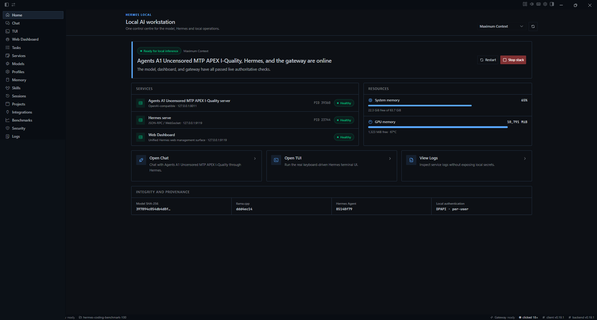
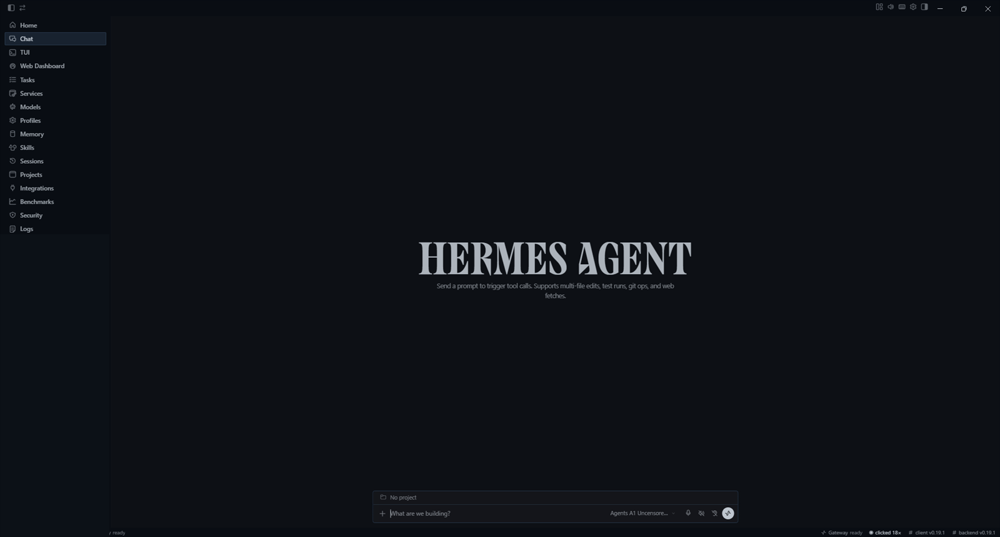
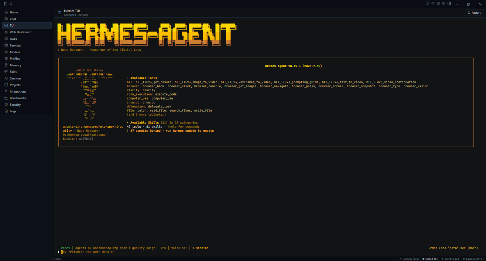
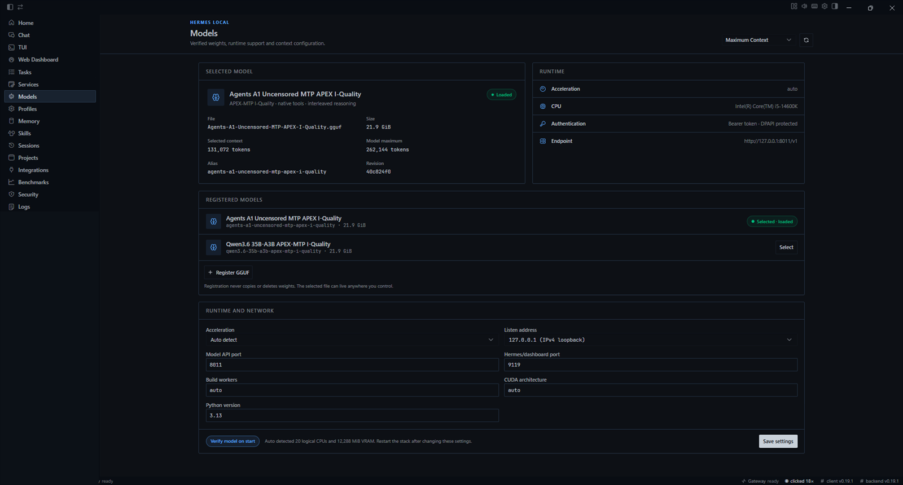
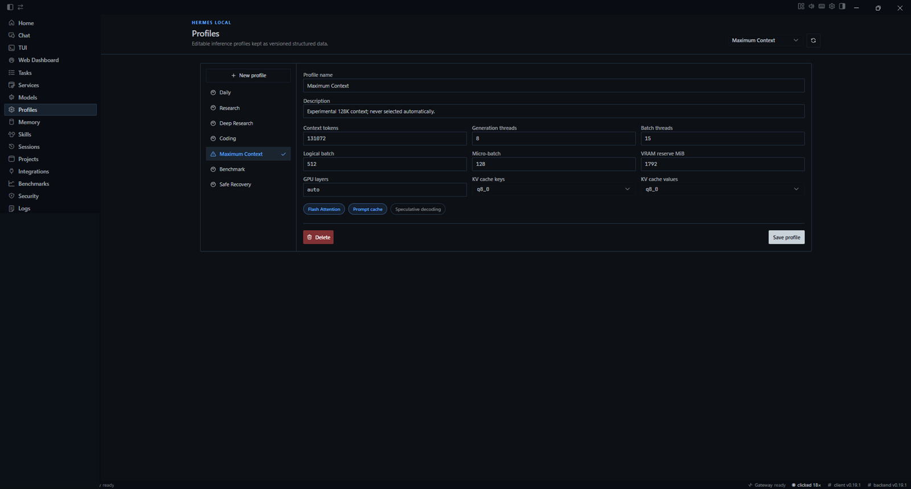
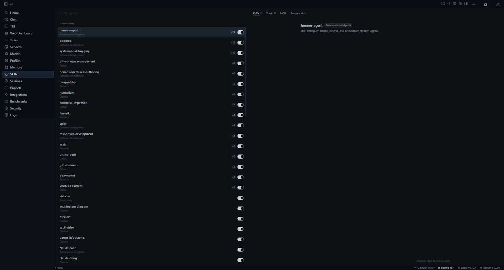
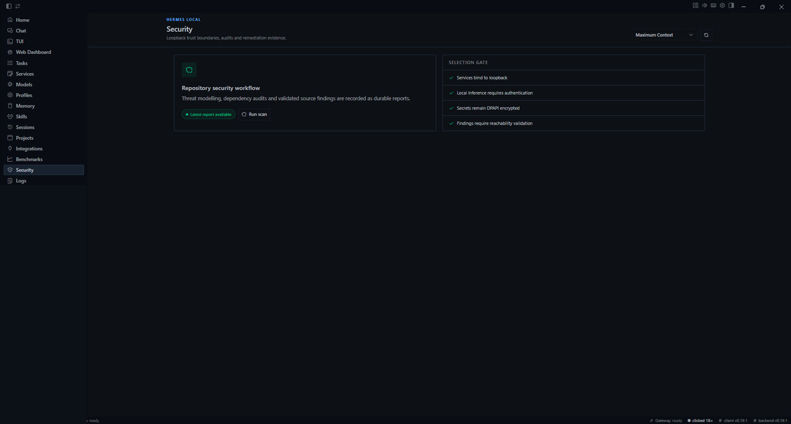
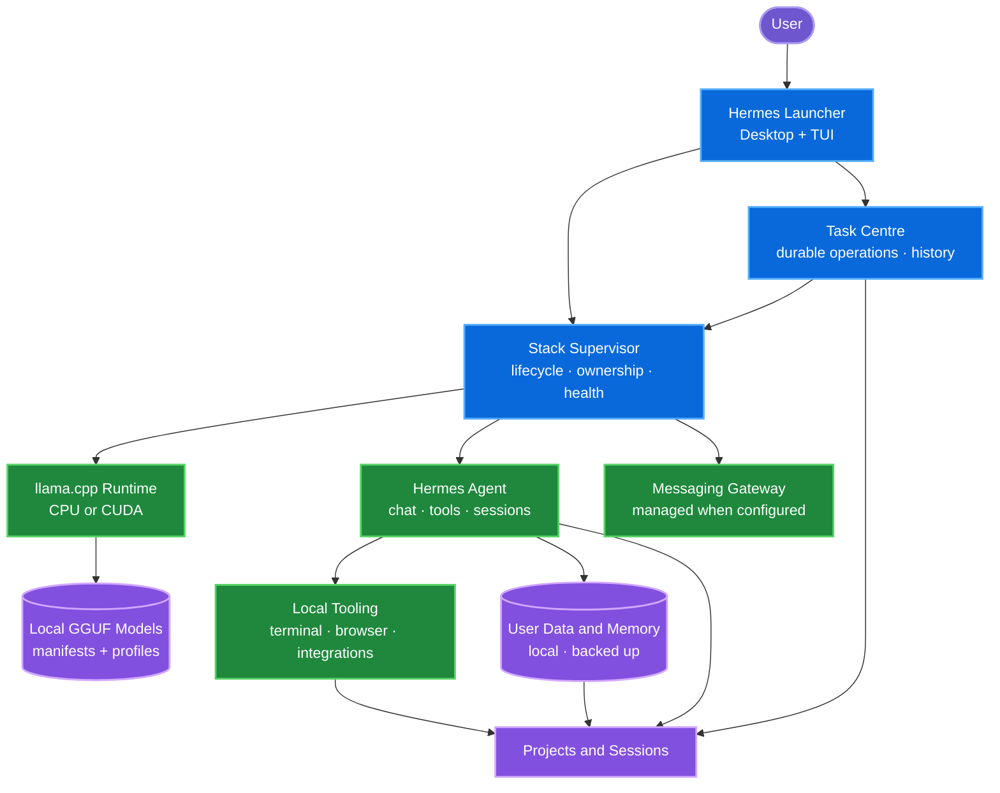

<div align="center">

# Hermes Local

### A Windows-first local AI workstation for Hermes Agent and llama.cpp.

Hermes Local turns a Windows PC into a private workstation for running, tuning,
benchmarking and operating local GGUF models—without requiring Docker, WSL or
a paid inference API.

[**Releases**](https://github.com/xdCloudy/Hermes-Local/releases/latest) ·
[**Install**](#install) ·
[**Explore the docs**](docs/README.md) ·
[**View the roadmap**](#roadmap) ·
[**Contribute**](CONTRIBUTING.md)

[](https://github.com/xdCloudy/Hermes-Local/releases/latest)
[](LICENSE)
[](docs/INSTALLATION.md)
[](docs/INSTALLATION.md)

[](https://github.com/xdCloudy/Hermes-Local/actions/workflows/powershell-validation.yml)
[](https://github.com/xdCloudy/Hermes-Local/actions/workflows/update-readme.yml)
[](https://github.com/xdCloudy/Hermes-Local/releases)
[](https://github.com/xdCloudy/Hermes-Local/issues)
[](https://github.com/xdCloudy/Hermes-Local/issues?q=is%3Aissue+is%3Aclosed)
[](https://github.com/xdCloudy/Hermes-Local/stargazers)
[](https://github.com/xdCloudy/Hermes-Local/commits/main)

> [!NOTE]
> Hermes Local is an independent Windows integration built on the official
> [NousResearch Hermes Agent](https://github.com/NousResearch/hermes-agent).
> It is not an official Nous Research release.

</div>



> [!IMPORTANT]
> Hermes Local is active pre-1.0 software. The current Windows release packages
> the control centre, but it is not yet a one-click full workstation installer.
> A provisioned repository checkout and native runtime are still required.
> Guided installation and verified prebuilt runtimes are tracked for v1.0.

## At a glance

<!-- BEGIN GENERATED STATUS -->
| Release | Delivery | Repository |
|---|---|---|
| **Current build:** v0.18.15<br>**Latest release:** [v0.18.1](https://github.com/xdCloudy/Hermes-Local/releases/tag/v0.18.1)<br>**Recent release:** Hermes Local v0.18.1 — Cold-start reliability · 2026-07-28 | **Current milestone:** [v0.18.x - Reliability Patch](https://github.com/xdCloudy/Hermes-Local/milestone/5)<br>**Current focus:** Close the remaining model-switch and lifecycle reliability gaps before expanding the control plane.<br>**Next:** Operational Control Plane | **Issues:** 44 open · 14 closed<br>**Overall completion:** 24%<br>**Recent commit:** [`ea85e3d`](https://github.com/xdCloudy/Hermes-Local/commit/ea85e3dfccb2d1f8019151a11962bd49fe5d0339) docs: refresh project dashboard |

> Status is generated from GitHub issues, milestones, releases and commits.
<!-- END GENERATED STATUS -->

## Why Hermes Local

Local AI is often presented as a model picker and a start button. The difficult
part begins after launch: matching a model and runtime to the machine, managing
RAM and VRAM, proving an optimisation helps, recovering from failures, and
keeping the whole system understandable.

Hermes Local treats those operational problems as part of the product.

| Principle | What it means |
|---|---|
| **Windows first** | Native PowerShell lifecycle, an Electron control centre, Windows process ownership and paths that work on any drive. |
| **Private by default** | Managed services bind to loopback, model weights stay local and a paid inference API is not required. |
| **Hardware aware** | Profiles account for CPU, GPU, RAM, VRAM, pagefile, context and workload rather than only a model name. |
| **Evidence led** | Benchmarks, diagnostics and acceptance reports are used to validate performance, stability and recovery claims. |
| **Recoverable** | Setup, health, logs, backup, repair, update and rollback are designed as one workstation lifecycle. |
| **Built to evolve** | Runtime adapters, AutoTune, certification and secure remote access are planned behind explicit contracts rather than one-off flags. |

The long-term goal is to make capable private AI practical and interactive on
consumer Windows hardware. Useful capability includes tool calling, structured
output, reasoning, long context and stability—not only generation speed.

## Current capability

`✅` available and validated · `🟡` available with known gaps · `🚧` active roadmap work · `⏳` planned

| Area | Current state | Status |
|---|---|:---:|
| Desktop and TUI | Packaged Electron control centre plus the integrated Hermes TUI | ✅ |
| Local inference | Managed llama.cpp CPU/CUDA serving through authenticated loopback endpoints | ✅ |
| Models | GGUF registration, selection and a tracked Qwen3.6 vision/MTP starter manifest; live model-switch activation remains open in [#84](https://github.com/xdCloudy/Hermes-Local/issues/84) | 🟡 |
| Profiles | Context, KV cache, threads, batching, offload, Flash Attention and prompt caching | ✅ |
| Lifecycle | Setup, start, stop, restart, repair, diagnostics and owned messaging-gateway management | ✅ |
| Benchmarks | Reproducible performance and memory runs with generated evidence; durable benchmark task instrumentation remains open in [#24](https://github.com/xdCloudy/Hermes-Local/issues/24) | 🟡 |
| Task Centre | Durable task schema, persistence and UI are present; feature-specific integrations are still being completed | 🟡 |
| Updates | Transactional PowerShell update and rollback paths exist; shared orchestration and native Desktop update flows remain active work | 🟡 |
| Projects | Basic project/session surfaces exist; stable project identity and the full Project Centre are tracked in [#27](https://github.com/xdCloudy/Hermes-Local/issues/27) | 🚧 |
| Memory and data | Local user-owned state, backup and restore exist; the Memory Centre and scoped data model remain planned | 🚧 |
| Security | Loopback authentication, DPAPI-protected credentials, threat modelling and security scans exist; signing, SBOM and provenance work remains open | 🟡 |
| Remote access | Local messaging integrations are supported; paired and permission-scoped remote access is planned in [#17](https://github.com/xdCloudy/Hermes-Local/issues/17) | ⏳ |
| Multi-backend inference | Runtime adapters, certification, routing and AutoTune are deliberately scheduled after the stable distribution work | ⏳ |

[See the detailed free/local feature matrix →](docs/FREE_FEATURE_MATRIX.md)

## See it in action

<table>
  <tr>
    <td width="50%"><br><strong>Chat</strong> - use the local model through the integrated Hermes Agent workspace.</td>
    <td width="50%"><br><strong>TUI</strong> - run the keyboard-driven Hermes terminal interface without leaving the launcher.</td>
  </tr>
  <tr>
    <td width="50%"><br><strong>Models</strong> - register GGUFs, inspect runtime identity and select the active local model.</td>
    <td width="50%"><br><strong>Profiles</strong> - tune context, cache, batching, offload and resource reserves as versioned settings.</td>
  </tr>
  <tr>
    <td width="50%"><br><strong>Skills</strong> - inspect and enable the skill catalogue available to Hermes Agent.</td>
    <td width="50%"><br><strong>Security</strong> - keep loopback, authentication, encryption and validated findings visible.</td>
  </tr>
</table>

The images were captured from the packaged `v0.18.15` launcher. Session history
and credential-bearing surfaces were removed before publication.

[Browse the complete screenshot catalog ->](docs/SCREENSHOTS.md)

## Roadmap

The foundational Windows workstation is already in place. The remaining roadmap
is release- and dependency-based. All current open and closed issues are
represented on the [Hermes Local Roadmap](https://github.com/users/xdCloudy/projects/1).
Tracking parents use native sub-issues, and cross-programme prerequisites use
native blocked-by relationships.

<!-- BEGIN GENERATED ROADMAP -->
| Stage | Purpose and success criteria | GitHub milestones | Progress |
|---|---|---|---:|
| 🚧 **Reliable Platform** | **Purpose:** Close the remaining model-switch and lifecycle reliability gaps before expanding the control plane.<br>**Success:** Cold starts, model changes, lifecycle transitions and recovery paths fail clearly and recover predictably. | [v0.18.x - Reliability Patch](https://github.com/xdCloudy/Hermes-Local/milestone/5) | **88%**<br>7/8 issues |
| 🚧 **Operational Control Plane** | **Purpose:** Complete dependable distribution, durable operations and shared update orchestration.<br>**Success:** Long-running work, updates, release evidence and lifecycle controls share authoritative state and recovery paths. | [v0.19 - Dependable Distribution and Control Plane](https://github.com/xdCloudy/Hermes-Local/milestone/6) | **28%**<br>5/18 issues |
| 🚧 **Project Centre and Product UX** | **Purpose:** Introduce stable project identity and complete the main product-management surfaces.<br>**Success:** Projects, chats, tasks, reports and product diagnostics remain correctly associated and recoverable. | [v0.20 - Project Centre and Product UX](https://github.com/xdCloudy/Hermes-Local/milestone/10) | **9%**<br>1/11 issues |
| ⏳ **Trust and Data Boundaries** | **Purpose:** Add shared trust contracts, scoped data access and secure access controls.<br>**Success:** Integrations, projects, memories, indexing and remote clients obey explicit permissions and isolation rules. | [v0.21 - Trust and Data Boundaries](https://github.com/xdCloudy/Hermes-Local/milestone/4) | **0%**<br>0/6 issues |
| 🎯 **Version 1.0 Stable** | **Purpose:** Deliver a supported Windows distribution for users who should not need a native build toolchain.<br>**Success:** Guided installation, verified runtime packages, release integrity and lifecycle recovery pass the stable release matrix. | [v1.0 - Stable](https://github.com/xdCloudy/Hermes-Local/milestone/11) | **0%**<br>0/3 issues |
| ⏳ **Post-v1.0 Inference Fabric** | **Purpose:** Generalise the current llama.cpp integration into a typed multi-backend runtime platform.<br>**Success:** Owned and external runtimes use common capability, identity, lifecycle and recovery contracts. | [Post-v1.0 - Inference Fabric Foundation](https://github.com/xdCloudy/Hermes-Local/milestone/9) | **0%**<br>0/5 issues |
| ⏳ **Post-v1.0 Optimisation and Observability** | **Purpose:** Turn hardware inspection and telemetry into safe workload-specific tuning.<br>**Success:** Memory planning, live metrics and resource policies improve useful performance without hiding trade-offs. | [Performance, AutoTune and Observability](https://github.com/xdCloudy/Hermes-Local/milestone/2) | **0%**<br>0/3 issues |
| ⏳ **Post-v1.0 Certification and Routing** | **Purpose:** Certify complete model/runtime/profile identities and route only between validated configurations.<br>**Success:** Tool use, long context, speculative decoding and fallback decisions are measurable and side-effect aware. | [Certification, Routing and Recovery](https://github.com/xdCloudy/Hermes-Local/milestone/3) | **0%**<br>0/3 issues |

Progress is derived from issue counts on the linked milestones. Dates are added
only when prerequisites and maintainer capacity support a credible release window.
<!-- END GENERATED ROADMAP -->

[Open the GitHub Project](https://github.com/users/xdCloudy/projects/1) ·
[Browse roadmap issues](https://github.com/xdCloudy/Hermes-Local/issues) ·
[Read the planning model](docs/PROJECT-VIEWS.md)

## Architecture



The launcher and supervisor are the Windows-native product layer. Hermes Agent
remains the agent core. The current managed inference backend is llama.cpp;
future adapters are planned behind typed capability and lifecycle contracts.

[Explore the architecture and trust boundaries →](docs/ARCHITECTURE.md)

## Install

### Current installation model

Hermes Local currently provisions a repository checkout and builds its managed
llama.cpp runtime locally. The release installer and portable executable contain
the control centre only; they do not bundle the source checkout, runtime or
model weights.

### Requirements

- Windows 10 or Windows 11 x64
- PowerShell 7
- Git, Node.js, uv and CMake; setup can install missing official packages with `winget`
- Visual Studio 2022 C++ Build Tools
- At least 16 GiB free before model weights
- Optional NVIDIA GPU, current driver and CUDA Toolkit for CUDA acceleration

The tracked Qwen3.6 starter configuration requires roughly 24.4 GB for the main
GGUF and vision projector. Allow at least 30 GB for those artifacts and more for
build outputs, dependency caches, reports and logs.

Open a normal, **non-elevated** PowerShell 7 window:

```powershell
git clone https://github.com/xdCloudy/Hermes-Local.git
Set-Location .\Hermes-Local
& '.\Setup-Hermes-Local.ps1' -NonInteractive
```

Setup reconstructs the pinned Hermes Agent integration, installs managed
dependencies, builds llama.cpp for the selected acceleration mode, optionally
downloads and verifies the starter model, writes provider configuration and
runs bootstrap diagnostics. It is designed to be rerun safely.

The [latest Windows release](https://github.com/xdCloudy/Hermes-Local/releases/latest)
can provide the packaged control centre after the repository has been
provisioned. Current release binaries are not Authenticode-signed; verify the
published SHA-256 values before running them.

[Installation options, CPU/CUDA selection and custom models →](docs/INSTALLATION.md)

## Quick start

```powershell
# Start the selected model, Hermes services and any configured messaging gateway
& '.\Start-Hermes-Local.ps1' -NonInteractive

# Open the desktop control centre
& '.\dist\Hermes Launcher.exe'

# Verify or stop the workstation
& '.\Test-Hermes-Local.ps1' -NonInteractive
& '.\Stop-Hermes-Local.ps1' -NonInteractive
```

The default model and dashboard endpoints are `http://127.0.0.1:8011/v1` and
`http://127.0.0.1:9119`. Both are configurable and remain restricted to IPv4 or
IPv6 loopback.

<details>
<summary><strong>Choose a profile for one start</strong></summary>

```powershell
& '.\Start-Hermes-Local.ps1' -Profile 'Coding' -NonInteractive
```

Omit `-Profile` to use the current launcher selection.

</details>

<details>
<summary><strong>Maintenance command reference</strong></summary>

| Action | Command |
|---|---|
| Restart | `& '.\Restart-Hermes-Local.ps1' -NonInteractive` |
| Repair | `& '.\Repair-Hermes-Local.ps1' -NonInteractive` |
| Backup | `& '.\Backup-Hermes-Local.ps1' -Name manual -NonInteractive` |
| Check updates | `& '.\Update-Hermes-Local.ps1' -Mode Check -NonInteractive` |
| Update Hermes Agent | `& '.\Update-Hermes-Agent.ps1' -Mode Apply` |
| Roll back Hermes Agent | `& '.\Update-Hermes-Agent.ps1' -Mode Rollback` |
| Security scan | `& '.\Security-Scan-Hermes-Local.ps1' -NonInteractive` |
| Diagnostics | `& '.\Export-Hermes-Diagnostics.ps1' -NonInteractive` |
| Full functional QA | `& '.\scripts\qa\Invoke-FullFunctionalQA.ps1' -Scope Full` |

[Read the complete operations guide →](docs/OPERATIONS.md)

</details>

## Documentation

| Start here | Build and operate | Evidence and governance |
|---|---|---|
| [Documentation home](docs/README.md) | [Installation](docs/INSTALLATION.md) | [Acceptance results](docs/ACCEPTANCE_RESULTS.md) |
| [User guide](docs/USER_GUIDE.md) | [Models and profiles](docs/MODEL_TUNING.md) | [Security model](docs/SECURITY.md) |
| [Architecture](docs/ARCHITECTURE.md) | [Update and rollback](docs/UPDATE_AND_ROLLBACK.md) | [Roadmap views](docs/PROJECT-VIEWS.md) |
| [Feature matrix](docs/FREE_FEATURE_MATRIX.md) | [Troubleshooting](docs/TROUBLESHOOTING.md) | [Development](docs/DEVELOPMENT.md) |

## Contributing

Contributions are welcome across Windows engineering, inference optimisation,
benchmarking, UX, documentation and testing.

1. Read the [contributor guide](CONTRIBUTING.md) and
   [development setup](docs/DEVELOPMENT.md).
2. Choose a
   [good first issue](https://github.com/xdCloudy/Hermes-Local/issues?q=is%3Aissue+is%3Aopen+label%3A%22good+first+issue%22)
   or a [help-wanted task](https://github.com/xdCloudy/Hermes-Local/issues?q=is%3Aissue+is%3Aopen+label%3A%22help+wanted%22).
3. Check the issue's parent, blocked-by relationships, milestone and Project
   fields before starting work.
4. Preserve the Windows-native, local-first security model and include
   verification evidence with the pull request.

[Development flow](CONTRIBUTING.md#development-flow) ·
[Open a feature request](https://github.com/xdCloudy/Hermes-Local/issues/new?template=feature_request.yml) ·
[Report a bug](https://github.com/xdCloudy/Hermes-Local/issues/new?template=bug_report.yml)

## FAQ

<details>
<summary><strong>Is Hermes Local a fork of Hermes Agent?</strong></summary>

Hermes Agent is the application core. Hermes Local is an independent
Windows-first integration and product layer that maintains a focused patch
series, launcher, supervisor, inference runtime and workstation lifecycle.

</details>

<details>
<summary><strong>Do I need Docker, WSL, cloud APIs or an NVIDIA GPU?</strong></summary>

No. Docker, WSL and paid APIs are not required. CPU inference is supported;
NVIDIA CUDA acceleration is optional. The current source-provisioned setup does
require a Windows native build toolchain.

</details>

<details>
<summary><strong>Does the repository include model weights?</strong></summary>

No. Model weights are never committed or bundled. The tracked starter manifest
can download a verified model and vision projector, and compatible local GGUF
files can be registered without copying them.

</details>

<details>
<summary><strong>Where does my data live?</strong></summary>

Substantial state stays beneath the Hermes Local root. Per-user launcher
settings are Git-ignored, backups include local settings and data, and API
credentials are protected for the current Windows user with DPAPI.

</details>

<details>
<summary><strong>How mature is the project?</strong></summary>

The current launcher has native packaging, lifecycle management, recovery,
benchmarking, security controls and a large automated QA corpus. It remains
pre-1.0: guided installation, verified runtime distribution, stable Project
Centre behaviour and several Desktop workflows are still under development.
Known limitations are published in the
[acceptance results](docs/ACCEPTANCE_RESULTS.md).

</details>

## License

Hermes Local is licensed under the [MIT License](LICENSE). Third-party
components, models and generated notices retain their own terms; see
[LICENSES.md](LICENSES.md).

---

<div align="center">

[Documentation](docs/README.md) ·
[Releases](https://github.com/xdCloudy/Hermes-Local/releases) ·
[Issues](https://github.com/xdCloudy/Hermes-Local/issues) ·
[Roadmap](https://github.com/users/xdCloudy/projects/1) ·
[Security](SECURITY.md) ·
[Contributing](CONTRIBUTING.md)

</div>
