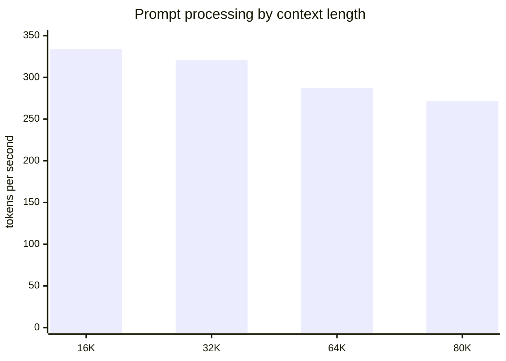

# Hermes Local benchmark report

## Technical summary

- **Selected configuration:** Research (64K) remains the daily quality profile; Deep Research exposes measured 80K operation with extra headroom.
- **Short generation:** 53.621 tok/s mean; **1,000-token sustained generation:** 54.994 tok/s mean with a 54.994 tok/s minimum.
- **Largest completed context:** 80K tokens. No profile is selected solely for a short-context score.
- **Correctness gate:** native tool-call and authenticated local-stack checks must pass before a profile is promoted.

## Long-context throughput stays usable

The chart shows synthetic prompt-processing throughput at each saved context length. It is a capacity and prefill test, not a model-quality score.

| Context | Prompt tok/s | Peak VRAM MiB | Peak RAM GiB | Page reads/s peak | Result |
|---:|---:|---:|---:|---:|---|
| 16K | 333.757 | 10739 | 17.99 | 7 | pass |
| 32K | 320.948 | 10788 | 18.11 | 19 | pass |
| 64K | 287.306 | 10741 | 18.1 | 19 | pass |
| 80K | 271.508 | 10721 | 18.13 | 7 | pass |

## Decode and tuning evidence

Sustained decode is the primary responsiveness gate. Thread, batch, CPU-MoE, KV-cache and VRAM-reserve sweeps are retained in `latest.json`; the selected profile favors correctness and memory stability before peak throughput.

| Scenario | Metric | Mean tok/s | Minimum tok/s | P95 latency ms/token | Threads | Batch / micro | CPU-MoE | KV |
|---|---|---:|---:|---:|---:|---:|---:|---:|
| short-chat-2k | prompt | 354.044 | 352.807 | 2.834 | 8 | 1024 / 256 | 0 | q8_0/q8_0 |
| short-chat-2k | generation | 53.621 | 47.309 | 21.138 | 8 | 1024 / 256 | 0 | q8_0/q8_0 |
| sustained-decode-1000 | generation | 54.994 | 54.994 | 18.184 | 8 | 1024 / 256 | 0 | q8_0/q8_0 |
| warm-standard | prompt | 353.931 | 350.869 | 2.85 | 8 | 1024 / 256 | 0 | q8_0/q8_0 |
| warm-standard | generation | 55.288 | 50.643 | 19.746 | 8 | 1024 / 256 | 0 | q8_0/q8_0 |
| thread-sweep | generation | 54.709 | 51.187 | 19.536 | 8 | 1024 / 256 | 0 | q8_0/q8_0 |
| thread-sweep | generation | 54.496 | 51.283 | 19.5 | 6 | 1024 / 256 | 0 | q8_0/q8_0 |
| thread-sweep | generation | 53.8 | 50.36 | 19.857 | 8 | 1024 / 256 | 0 | q8_0/q8_0 |
| thread-sweep | generation | 54.235 | 50.778 | 19.693 | 10 | 1024 / 256 | 0 | q8_0/q8_0 |
| thread-sweep | generation | 51.87 | 48.828 | 20.48 | 14 | 1024 / 256 | 0 | q8_0/q8_0 |
| cpu-moe-sweep | generation | 54.495 | 51.129 | 19.559 | 8 | 1024 / 256 | 0 | q8_0/q8_0 |
| cpu-moe-sweep | generation | 54.695 | 51.241 | 19.516 | 8 | 1024 / 256 | 4 | q8_0/q8_0 |
| cpu-moe-sweep | generation | 54.141 | 50.468 | 19.815 | 8 | 1024 / 256 | 8 | q8_0/q8_0 |
| cpu-moe-sweep | generation | 53.977 | 50.222 | 19.912 | 8 | 1024 / 256 | 16 | q8_0/q8_0 |
| cpu-moe-sweep | generation | 54.817 | 51.296 | 19.495 | 8 | 1024 / 256 | 24 | q8_0/q8_0 |
| cpu-moe-sweep | generation | 54.728 | 51.125 | 19.56 | 8 | 1024 / 256 | 32 | q8_0/q8_0 |
| cpu-moe-sweep | generation | 53.768 | 49.587 | 20.167 | 8 | 1024 / 256 | 40 | q8_0/q8_0 |
| batch-sweep-512 | prompt | 354.166 | 353.443 | 2.829 | 8 | 1024 / 256 | 0 | q8_0/q8_0 |
| batch-sweep-512 | prompt | 218.576 | 216.655 | 4.616 | 8 | 1024 / 128 | 0 | q8_0/q8_0 |
| batch-sweep-512 | prompt | 344.136 | 342.532 | 2.919 | 8 | 512 / 256 | 0 | q8_0/q8_0 |
| batch-sweep-512 | prompt | 214.809 | 214.714 | 4.657 | 8 | 512 / 128 | 0 | q8_0/q8_0 |
| batch-sweep-1024 | prompt | 351.714 | 347.097 | 2.881 | 8 | 1024 / 256 | 0 | q8_0/q8_0 |
| batch-sweep-1024 | prompt | 359.608 | 356.37 | 2.806 | 8 | 1024 / 256 | 0 | q8_0/q8_0 |
| batch-sweep-1024 | prompt | 354.756 | 354.062 | 2.824 | 8 | 1024 / 256 | 0 | q8_0/q8_0 |
| batch-sweep-1024 | prompt | 354.11 | 351.248 | 2.847 | 8 | 1024 / 256 | 0 | q8_0/q8_0 |
| batch-sweep-2048 | prompt | 355.505 | 353.517 | 2.829 | 8 | 1024 / 256 | 0 | q8_0/q8_0 |
| batch-sweep-2048 | prompt | 574.39 | 573.388 | 1.744 | 8 | 1024 / 512 | 0 | q8_0/q8_0 |
| batch-sweep-2048 | prompt | 348.665 | 347.014 | 2.882 | 8 | 2048 / 256 | 0 | q8_0/q8_0 |
| batch-sweep-2048 | prompt | 553.975 | 553.922 | 1.805 | 8 | 2048 / 512 | 0 | q8_0/q8_0 |
| kv-sweep-f16 | prompt | 349.893 | 348.389 | 2.87 | 8 | 1024 / 256 | 0 | q8_0/q8_0 |
| kv-sweep-f16 | generation | 50.537 | 44.888 | 22.278 | 8 | 1024 / 256 | 0 | q8_0/q8_0 |
| kv-sweep-f16 | prompt | 94.284 | 93.404 | 10.706 | 8 | 1024 / 256 | 0 | q8_0/f16 |
| kv-sweep-f16 | generation | 41.049 | 37.293 | 26.815 | 8 | 1024 / 256 | 0 | q8_0/f16 |
| kv-sweep-f16 | prompt | 41.686 | 41.635 | 24.018 | 8 | 1024 / 256 | 0 | f16/q8_0 |
| kv-sweep-f16 | generation | 40.836 | 37.496 | 26.669 | 8 | 1024 / 256 | 0 | f16/q8_0 |
| kv-sweep-f16 | prompt | 350.001 | 346.397 | 2.887 | 8 | 1024 / 256 | 0 | f16/f16 |
| kv-sweep-f16 | generation | 52.106 | 46.322 | 21.588 | 8 | 1024 / 256 | 0 | f16/f16 |
| kv-sweep-q8 | prompt | 353.272 | 346.908 | 2.883 | 8 | 1024 / 256 | 0 | q8_0/q8_0 |
| kv-sweep-q8 | generation | 50.778 | 45.666 | 21.898 | 8 | 1024 / 256 | 0 | q8_0/q8_0 |
| kv-sweep-q8 | prompt | 350.941 | 350.176 | 2.856 | 8 | 1024 / 256 | 0 | q8_0/q8_0 |
| kv-sweep-q8 | generation | 50.79 | 45.452 | 22.001 | 8 | 1024 / 256 | 0 | q8_0/q8_0 |
| kv-sweep-q8 | prompt | 348.409 | 346.537 | 2.886 | 8 | 1024 / 256 | 0 | q8_0/q8_0 |
| kv-sweep-q8 | generation | 51.466 | 45.434 | 22.01 | 8 | 1024 / 256 | 0 | q8_0/q8_0 |
| kv-sweep-q8 | prompt | 345.712 | 345.522 | 2.894 | 8 | 1024 / 256 | 0 | q8_0/q8_0 |
| kv-sweep-q8 | generation | 51.126 | 45.988 | 21.745 | 8 | 1024 / 256 | 0 | q8_0/q8_0 |
| kv-sweep-q4 | prompt | 361.497 | 355.981 | 2.809 | 8 | 1024 / 256 | 0 | q8_0/q8_0 |
| kv-sweep-q4 | generation | 51.756 | 46.943 | 21.302 | 8 | 1024 / 256 | 0 | q8_0/q8_0 |
| kv-sweep-q4 | prompt | 43.633 | 43.633 | 22.919 | 8 | 1024 / 256 | 0 | q8_0/q4_0 |
| kv-sweep-q4 | generation | 40.693 | 37.157 | 26.913 | 8 | 1024 / 256 | 0 | q8_0/q4_0 |
| kv-sweep-q4 | prompt | 47.099 | 47.061 | 21.249 | 8 | 1024 / 256 | 0 | q4_0/q8_0 |
| kv-sweep-q4 | generation | 40.194 | 35.737 | 27.982 | 8 | 1024 / 256 | 0 | q4_0/q8_0 |
| kv-sweep-q4 | prompt | 345.022 | 343.241 | 2.913 | 8 | 1024 / 256 | 0 | q4_0/q4_0 |
| kv-sweep-q4 | generation | 50.899 | 46.079 | 21.702 | 8 | 1024 / 256 | 0 | q4_0/q4_0 |
| reserve-sweep | prompt | 350.69 | 346.296 | 2.888 | 8 | 1024 / 256 | 0 | q8_0/q8_0 |
| reserve-sweep | generation | 51.263 | 45.785 | 21.841 | 8 | 1024 / 256 | 0 | q8_0/q8_0 |
| reserve-sweep | prompt | 358.763 | 355.451 | 2.813 | 8 | 1024 / 256 | 0 | q8_0/q8_0 |
| reserve-sweep | generation | 52.573 | 47.532 | 21.038 | 8 | 1024 / 256 | 0 | q8_0/q8_0 |
| reserve-sweep | prompt | 354.253 | 353.786 | 2.827 | 8 | 1024 / 256 | 0 | q8_0/q8_0 |
| reserve-sweep | generation | 51.222 | 45.263 | 22.093 | 8 | 1024 / 256 | 0 | q8_0/q8_0 |
| reserve-sweep | prompt | 336.759 | 336.352 | 2.973 | 8 | 1024 / 256 | 0 | q8_0/q8_0 |
| reserve-sweep | generation | 50.691 | 46.318 | 21.59 | 8 | 1024 / 256 | 0 | q8_0/q8_0 |

## Scope, data and metric definitions

- `llama-bench` uses deterministic synthetic token sequences. Prompt and generation throughput are the tool-reported arithmetic means across saved repetitions.
- Minimum generation rate is the lowest saved repetition. P95 latency is the nearest-rank 95th percentile of full-repetition duration divided by tokens.
- RAM is the benchmark process peak working set; committed memory and page reads come from Windows performance counters. VRAM, utilization, temperature and power come from `nvidia-smi` samples.
- Context tests use Q8_0 key/value cache, Flash Attention, automatic CUDA fitting and the stated VRAM reserve.

## Methodology

- Model: `Laguna-XS-2.1-Q4_K_M.gguf` (`1ac7079101fca5a6df8c5a7523a3c30ea7d1c0e4b1258090e7d6d4039287f6cb`).
- llama.cpp: `0e4a0362239713ea95a6864a17a8de4b0ad90d62` build 10154.
- Fixed seed: 3407. Full commands are recorded per case in `latest.json`.
- Cold/warm, 2K/16K/32K/64K/80K, long prefill, 1,000-token decode, cache reuse, CPU-MoE, thread, batch, KV and reserve sweeps are included. Speculative decoding is omitted because no compatible verified draft model is installed.

## Limitations and robustness checks

- Synthetic throughput does not measure answer quality. Deterministic reply, native tool-call and Hermes agent tests are separate promotion gates.
- A single workstation run does not establish cross-machine performance. Background Windows activity can affect tail latency and page-read counters.
- Prompt-cache speedup is a live-server wall-clock comparison and may include scheduler variance.
- 128K remains experimental and is not automatically selected because this required suite caps its long-context gate at 80K.

## Recommended next steps

1. Keep Research at 64K for quality-first daily use and expose Deep Research at 80K only when the saved run passes without CUDA OOM or active page-file thrashing.
2. Re-run this harness after any model, llama.cpp, driver, CUDA, KV-cache or thread/batch change.
3. Do not enable speculative decoding until a compatible draft model passes output and tool-call equivalence tests.

## Further questions

- Would a verified Laguna-compatible draft model improve latency without reducing tool-call fidelity?
- Does a longer overnight agent trajectory reveal memory pressure not visible in the bounded 1,000-token decode?
