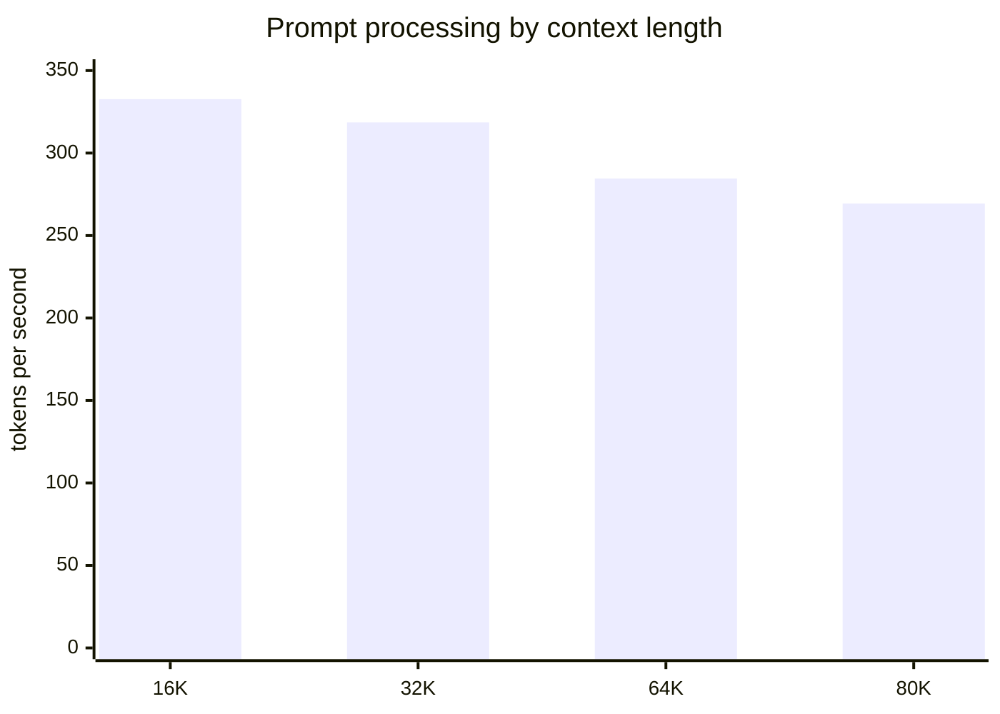

# Hermes Local benchmark report

## Decision

- **Selected default:** Daily is the 64K quality-first default; Research mirrors that stable configuration and Deep Research exposes measured 80K operation with additional VRAM reserve.
- **Short generation:** 53.297 tok/s mean; **1,000-token sustained generation:** 54.57 tok/s mean with a 54.57 tok/s minimum.
- **Largest completed context:** 80K tokens. No profile is selected solely for a short-context score.
- **Stability:** 0 failed native cases; selected 64K case peaked at 7 hard-page reads/s and 2% peak paging-file usage (0 percentage-point change).
- **Correctness:** authenticated local-stack checks passed and native tool-call validity is true.
- **Prompt-cache reuse:** 287.31x wall-clock speedup (24674.19 ms cold to 85.88 ms warm).

## Test scope

- Generated: 07/28/2026 02:30:42; run duration: 51.2 minutes.
- Host: Intel(R) Core(TM) i5-14600K, 14 cores / 20 logical processors, 63.7 GiB RAM.
- GPU: NVIDIA GeForce RTX 3060, 12288 MiB, driver 610.74, compute capability 8.6.
- Cold start: 6 s estimated model load/setup.

## Long-context throughput

The chart shows synthetic prompt-processing throughput at each saved context length. It is a capacity and prefill measurement, not a model-quality score.

| Context | Prompt tok/s | Decode tok/s | P95 decode ms/token | Peak VRAM MiB | Peak RAM GiB | Page reads/s peak | Paging file peak % |
|---:|---:|---:|---:|---:|---:|---:|---:|
| 16K | 332.672 | 40.052 | 29.936 | 10743 | 17.99 | 3 | 2 |
| 32K | 318.644 | 41.114 | 29.609 | 10797 | 18.11 | 18 | 2 |
| 64K | 284.582 | 33.062 | 30.246 | 10750 | 18.1 | 7 | 2 |
| 80K | 269.377 | 33.347 | 29.987 | 10743 | 18.13 | 19 | 2 |

## Interactive performance

Sustained decode is the primary responsiveness gate. Exact commands and repetition samples are retained in `latest.json`.

| Scenario | Mean tok/s | Minimum tok/s | P95 latency ms/token |
|---|---:|---:|---:|
| short-chat-2k | 53.297 | 46.075 | 21.704 |
| sustained-decode-1000 | 54.57 | 54.57 | 18.325 |
| warm-standard | 55.711 | 50.981 | 19.615 |

## Tuning evidence

Fastest points are shown for orientation; the operational choice still follows correctness, paging, OOM safety, quality, then sustained speed.

| Sweep | Fastest measured point | Mean tok/s | Operational decision |
|---|---|---:|---|
| Generation threads | 6 threads | 54.596 | Keep 8 threads; it is P-core-focused and within run variance of the fastest point. |
| CPU-MoE placement | 0 layers | 55.205 | Keep 0 explicit CPU-MoE layers; the measured difference is too small to justify added placement complexity. |
| Batch / micro-batch | 2048 / 512 | 563.205 prompt | Keep 1024 / 256 because that exact pair passed the 64K and 80K gates; larger micro-batches were only swept at 4K. |
| Matched KV cache | f16 / f16 | 51.354 generation | Keep Q8_0 / Q8_0 because it passed the 64K/80K capacity gates with headroom; Q4 remains a measured fallback and F16 was not capacity-tested at those contexts. |
| VRAM reserve | 1024 MiB | 50.578 generation | Keep 1536 MiB for Daily/Research and 2048 MiB for Deep Research to retain operating margin. |

## Validation and traceability

- Calculation spot-check: 41/41 saved rows independently recomputed within 0.002.
- Native case validation: 0 failed cases; parsed row validation is recorded per case.
- Authenticated correctness: 8 checks; invalid outputs observed: 0; native tool call valid: True.
- Primary evidence: `benchmarks/results/latest.json`; correctness evidence: `logs/diagnostics/latest-test.json`.

## Scope, data and metric definitions

- `llama-bench` uses deterministic synthetic token sequences. Prompt and generation throughput are the tool-reported arithmetic means across saved repetitions.
- Minimum generation rate is the lowest saved repetition. P95 latency is the nearest-rank 95th percentile of full-repetition duration divided by tokens.
- RAM is the benchmark process peak working set. Committed memory, hard-page reads, effective CPU frequency and paging-file usage come from Windows performance counters.
- VRAM, GPU utilization, temperature, power and SM clock come from `nvidia-smi` samples.
- Context tests use Q8_0 key/value cache, Flash Attention, automatic CUDA fitting and the stated VRAM reserve.

## Methodology

- Model: `Laguna-XS-2.1-Q4_K_M.gguf` (`1ac7079101fca5a6df8c5a7523a3c30ea7d1c0e4b1258090e7d6d4039287f6cb`).
- llama.cpp: `0e4a0362239713ea95a6864a17a8de4b0ad90d62` build 10154.
- Fixed seed: 3407. Full commands are recorded per case in `latest.json`.
- Cold/warm, 2K/16K/32K/64K/80K, long prefill, 1,000-token decode, cache reuse, CPU-MoE, thread, batch, KV and reserve sweeps are included. Speculative decoding is omitted because no compatible verified draft model is installed.

## Limitations and robustness checks

- Synthetic throughput does not measure answer quality. Deterministic reply, native tool-call and Hermes agent tests are separate promotion gates.
- A single workstation run does not establish cross-machine performance. Background Windows activity can affect tail latency and page-read counters.
- Windows `PageReadsPersec` is a hard-page-read signal and can include mapped-file reads; paging-file percentage is recorded separately. Low values support “no active thrashing” but do not identify every read source.
- Prompt-cache speedup is a two-pass live-server wall-clock comparison. The server did not return a cached-token count, so reuse is inferred from identical requests plus the latency reduction and may include scheduler variance.
- Cold model-load time is an external estimate that includes small process setup and teardown overhead.
- 128K remains experimental and is not automatically selected because this required suite caps its long-context gate at 80K.

## Recommended next steps

1. Keep Daily and Research at 64K for quality-first use; expose Deep Research at measured 80K with its larger reserve and explicit latency warning.
2. Re-run this harness after any model, llama.cpp, driver, CUDA, KV-cache or thread/batch change.
3. Do not enable speculative decoding until a compatible draft model passes output and tool-call equivalence tests.

## Further questions

- Would a verified Laguna-compatible draft model improve latency without reducing tool-call fidelity?
- Does a longer overnight agent trajectory reveal memory pressure not visible in the bounded 1,000-token decode?
