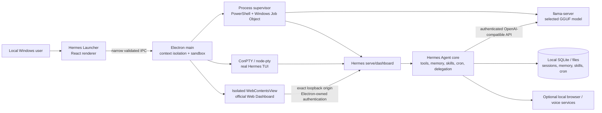
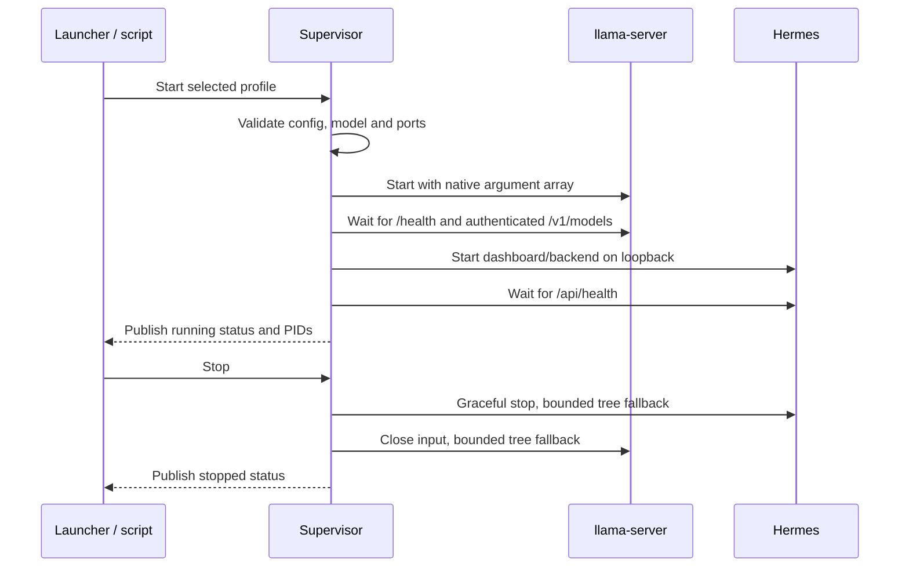

# Architecture

[← Documentation home](README.md) · [Project home](../README.md)

## System view

## Components

- **React renderer:** official Hermes Desktop plus local workstation views. It
  has no Node integration and never receives persistent model or dashboard
  credentials in its normal workstation snapshot.
- **Electron main/preload:** owns process and filesystem operations. The
  context bridge exposes a narrow typed API; actions, profiles, paths, log
  reads, view bounds and sizes are validated in the main process.
- **Embedded dashboard:** a dedicated sandboxed `WebContentsView` loads only
  the configured HTTP loopback origin. Electron injects the protected session
  header only for that exact origin, denies permissions, downloads and
  cross-origin requests, and sends external links to the system browser.
  Hiding the Dashboard route preserves the embedded renderer and its page
  state; backend outages and renderer crashes use bounded reconnect states.
  Dashboard navigation is serialized so repeated renderer layout or show calls
  share one in-flight load. A completed successful same-origin main-frame
  request is authoritative readiness evidence, with DOM and Electron load
  lifecycle events retained as fallbacks. Only a cross-document main-frame
  navigation resets readiness; later generic loading activity and same-document
  route changes cannot hide an already usable dashboard. A settled same-origin
  document also repairs stale loading state on the next show or stop event.
  Renderer DOM rectangles are converted from the active UI zoom's CSS-pixel
  coordinate space into BrowserWindow device-independent coordinates at the
  trusted Electron IPC boundary. The trusted sender supplies its actual zoom
  factor; scaled edges are rounded before width and height are derived so all
  four native view edges remain confined to the renderer host at every UI scale.
- **TUI:** node-pty/ConPTY runs the actual managed Hermes executable. Renderer
  IPC cannot open an arbitrary shell command.
- **Supervisor:** starts, health-checks and stops services in dependency order.
  A named Windows Job Object kills descendants if the supervisor exits.
- **Hermes backend/dashboard:** one managed Hermes process provides the local
  backend and official web dashboard.
- **llama-server:** the pinned llama.cpp build uses the selected CPU/CUDA
  acceleration mode to serve the selected registered GGUF.
- **Data layer:** Hermes state, sessions, memory, skills, cron, user workspace
  and runtime state remain beneath `<project-root>\data`.

## Ports and authentication

| Port | Owner | Binding | Authentication |
|---:|---|---|---|
| Configured model port (default 8011) | llama-server | IPv4/IPv6 loopback only | Per-user bearer token read from an ACL-restricted transient file |
| Configured Hermes port (default 9119) | Hermes backend/dashboard | IPv4/IPv6 loopback only | Generated Hermes dashboard/session token |

The persistent token is encrypted with DPAPI for the current Windows user.
During model startup, the supervisor writes a short-lived, user-only token
file, passes its path through `--api-key-file`, and removes the file after
health is established. The token itself is absent from process command lines.

The embedded dashboard does not receive its protected token through renderer
JavaScript, query parameters or persisted browser storage. Electron attaches
it at the isolated session's request boundary only when the request maps to the
active configured loopback origin. Changing the configured host, port or token
destroys the old embedded view before a new connection is made.

## Trust boundaries

1. **Renderer to Electron:** the renderer is untrusted relative to native
   authority. CSP, sandbox, context isolation, navigation denial and
   schema-validated IPC enforce the boundary.
2. **Embedded dashboard to Electron and network:** the dashboard runs in a
   separate sandboxed renderer/session. Only its exact configured loopback
   origin and matching WebSocket origin are allowed; permissions, downloads,
   new native windows and cross-origin navigation are denied.
3. **Browser/network content to Hermes tools:** URLs, origins, response sizes
   and filesystem destinations are validated. Browser automation remains an
   explicit, security-sensitive local tool.
4. **Model to host tools:** model-generated commands and writes are untrusted.
   Dangerous commands, memory writes and skill writes require approval;
   destructive operations targeting the installation are denied by default.
5. **Local services to host network:** listeners are loopback-only. No LAN
   listener or public gateway is enabled.
6. **Updates to active runtime:** candidate source is fetched and built in
   staging, integrity is checked and smoke tests run before a switch. User
   data is outside replaceable build locations.

## Startup and shutdown

The supervisor checks health every two seconds, requires three consecutive
failures before recovery and uses exponential backoff with restart-loop
protection. PID files are treated as hints and checked for staleness.

The Electron workstation controller admits native actions through the
[versioned task lifecycle and resource-lock model](decisions/0001-task-lifecycle-and-resource-locks.md).
Repeated non-terminal actions join one task, exclusive maintenance locks the
workstation, and automatic readiness queues only when its shared workstation
claim conflicts. Benchmarking owns the model runtime but remains compatible
with gateway readiness, while observational health and reconnect work never
acquires task locks. Completed task history is bounded at 50 without pruning
active work. The registry is atomically persisted at
`data/runtime/desktop-tasks.json`; restart reconciliation checks recorded owner
PIDs and action-specific reports, archives or runtime state before assigning a
terminal outcome. A surviving child becomes an externally owned task, while
ambiguous or stale records become `interrupted` instead of remaining falsely
active. Concurrent snapshot requests share one in-flight read and probe the
model at `/health`, Hermes at `/api/health`, and the dashboard at `/`. Renderer
polling uses request generations and mounted-state guards so stale or late
results cannot replace newer state. The Task Centre filters and selects only
records from each authoritative snapshot, shows bounded redacted output and
result or recovery evidence, and exposes only capabilities computed by the
main process. Running cancellation is limited to the exact live child process
owned by the current Desktop; recovered external owners remain observable but
cannot be signalled. Terminal tasks can be retried as new admissions, and the
sidebar derives its active count from the same task-list boundary.

Profile saves carry both the edited name and the original name. A rename
replaces the original entry, rejects collisions, and migrates the selected
profile. Ordinary Unicode letters and numbers are accepted within the same
length and punctuation constraints. Profile controls combine profile-owned
settings with effective model-manifest features; manifest-managed speculative
decoding is shown as active and read-only rather than as a disabled profile
option.

## Source and update architecture

Hermes Local owns and directly tracks the complete native client at
`apps/desktop` and the wire-contract package at `packages/hermes-agent-client`.
Client changes use normal root-repository review, history and CI; there is no
generated overlay and no Desktop source hidden in the Agent checkout.

The official Agent checkout retains `upstream` and pins upstream commit
`91937a6dc3ffbbe2f3be91a500f0ecf962c4cf53`. Runtime-only harness commits live
on `hermes-local-harness`; the 26 ordered mail patches under
`source\hermes-launcher\patches` reconstruct harness tree
`456412520ba89bb1711f7a644c1350718b34fab9`. Setup verifies that tree even when
local committer metadata produces a different commit ID. CI rejects any patch
that touches `apps/desktop`.
