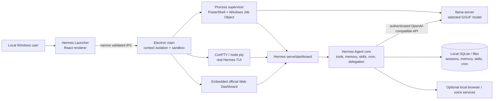
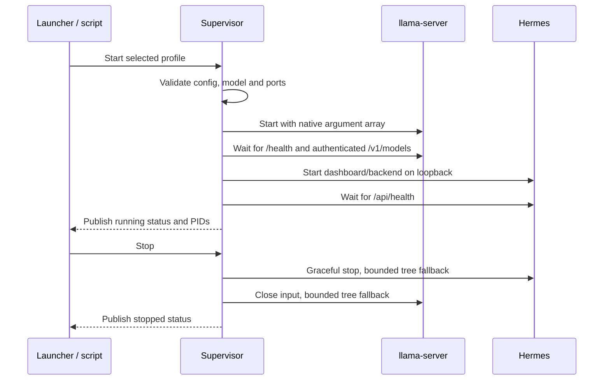

# Architecture

[← Documentation home](README.md) · [Project home](../README.md)

## System view

## Components

- **React renderer:** official Hermes Desktop plus local workstation views. It
  has no Node integration and never receives the persistent model token in its
  normal workstation snapshot.
- **Electron main/preload:** owns process and filesystem operations. The
  context bridge exposes a narrow typed API; actions, profiles, paths, log
  reads and sizes are validated in the main process.
- **TUI:** node-pty/ConPTY runs the actual managed Hermes executable. Renderer
  IPC cannot open an arbitrary shell command.
- **Supervisor:** starts, health-checks and stops services in dependency order.
  A named Windows Job Object kills descendants if the supervisor exits.
- **Hermes backend/dashboard:** one managed Hermes process provides the local
  backend and official web dashboard.
- **llama-server:** the pinned llama.cpp build uses the selected CPU/CUDA
  acceleration mode to serve the selected registered GGUF.
- **Data layer:** Hermes state, sessions, memory, skills, cron, user workspace
  and runtime state remain beneath `<project-root>\data`.

## Ports and authentication

| Port | Owner | Binding | Authentication |
|---:|---|---|---|
| Configured model port (default 8011) | llama-server | IPv4/IPv6 loopback only | Per-user bearer token read from an ACL-restricted transient file |
| Configured Hermes port (default 9119) | Hermes backend/dashboard | IPv4/IPv6 loopback only | Generated Hermes dashboard/session token |

The persistent token is encrypted with DPAPI for the current Windows user.
During model startup, the supervisor writes a short-lived, user-only token
file, passes its path through `--api-key-file`, and removes the file after
health is established. The token itself is absent from process command lines.

## Trust boundaries

1. **Renderer to Electron:** the renderer is untrusted relative to native
   authority. CSP, sandbox, context isolation, navigation denial and
   schema-validated IPC enforce the boundary.
2. **Browser/network content to Hermes tools:** URLs, origins, response sizes
   and filesystem destinations are validated. Browser automation remains an
   explicit, security-sensitive local tool.
3. **Model to host tools:** model-generated commands and writes are untrusted.
   Dangerous commands, memory writes and skill writes require approval;
   destructive operations targeting the installation are denied by default.
4. **Local services to host network:** listeners are loopback-only. No LAN
   listener or public gateway is enabled.
5. **Updates to active runtime:** candidate source is fetched and built in
   staging, integrity is checked and smoke tests run before a switch. User
   data is outside replaceable build locations.

## Startup and shutdown

The supervisor checks health every two seconds, requires three consecutive
failures before recovery and uses exponential backoff with restart-loop
protection. PID files are treated as hints and checked for staleness.

The Electron workstation controller serializes native actions globally:
repeating the same action reuses its task, while a different action receives a
clear busy response. Completed task history is bounded at 50. Concurrent
snapshot requests share one in-flight read and probe the model at `/health`,
Hermes at `/api/health`, and the dashboard at `/`. Renderer polling uses
request generations and mounted-state guards so stale or late results cannot
replace newer state.

Profile saves carry both the edited name and the original name. A rename
replaces the original entry, rejects collisions, and migrates the selected
profile. Ordinary Unicode letters and numbers are accepted within the same
length and punctuation constraints.

## Source and update architecture

The official checkout retains `upstream` and pins upstream commit
`3be565fbdee3115ab5b9338551768b8e5e655c56`. Local integration commits live
on `hermes-local-integration`; the ordered mail patch series is under
`source\hermes-launcher\patches`. Setup can reconstruct the exact recorded
tree from the pinned upstream commit and verifies the tree hash even when
local Git committer metadata produces different commit IDs.

The current series contains patches 0001–0018 and reconstructs tree
`7bb0c8193032541edfd45cdc3802bd85d6b195b0`.
