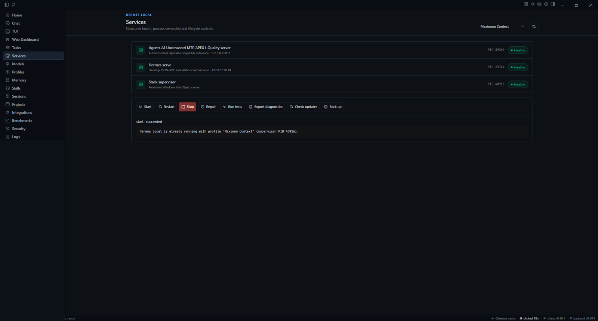

# Screenshot catalog

[<- Documentation home](README.md) | [Project home](../README.md) |
[Launcher design](design/DESIGN_SPEC.md)

These captures document the packaged `v0.18.15` launcher. They were reviewed
before publication and the session-history area was removed. Screens containing
credentials, user identifiers or conversation content are not committed.

## Core experience

| Surface | Screenshot | Purpose |
|---|---|---|
| Home | [Open](assets/screenshots/home.png) | Authoritative workstation readiness, service health and resource state |
| Chat | [Open](assets/screenshots/chat.png) | Integrated Hermes Agent conversation workspace |
| TUI | [Open](assets/screenshots/tui.png) | Keyboard-driven Hermes Agent terminal interface |
| Models | [Open](assets/screenshots/models.png) | Registered GGUFs, active model identity and runtime settings |
| Profiles | [Open](assets/screenshots/profiles.png) | Context, cache, batching, offload and resource profile editor |
| Skills | [Open](assets/screenshots/skills.png) | Skill catalogue and enablement controls |
| Services | [Open](assets/screenshots/services.png) | Process health and lifecycle operations |
| Security | [Open](assets/screenshots/security.png) | Local security controls and scan entry point |

## Gallery

<table>
  <tr>
    <td width="50%"> <strong>Home</strong></td>
    <td width="50%"> <strong>Chat</strong></td>
  </tr>
  <tr>
    <td width="50%"> <strong>TUI</strong></td>
    <td width="50%"> <strong>Models</strong></td>
  </tr>
  <tr>
    <td width="50%"> <strong>Profiles</strong></td>
    <td width="50%"> <strong>Skills</strong></td>
  </tr>
  <tr>
    <td width="50%"> <strong>Services</strong></td>
    <td width="50%"> <strong>Security</strong></td>
  </tr>
</table>

## Capture policy

- Use the current packaged build and identify its version in the pull request.
- Prefer captures at 1440 px or wider and optimise them without making text unreadable.
- Remove tokens, user IDs, personal paths, conversation titles and private project names.
- Do not publish a masked credential merely because most characters are hidden.
- Use realistic state, but avoid screenshots that imply unfinished functionality is complete.
- Update this page and the README gallery when the launcher information architecture changes.
