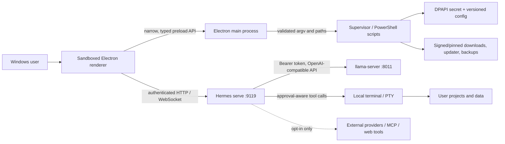

# Hermes Local threat model

Status: reviewed 2026-07-28  
Scope: `D:\Hermes-Local` and NousResearch/hermes-agent revision `3be565fb...` plus the `hermes-local-integration` patch series  
Default deployment: one Windows user, native Windows processes, loopback-only services, local Laguna XS 2.1 model

## Security objectives

1. Model weights, prompts, sessions, memory, projects, and local files remain on the workstation unless the user deliberately enables an integration or network tool.
2. The Electron renderer cannot acquire general Node or operating-system access; every native action crosses an explicit preload/IPC capability.
3. The model and Hermes HTTP/WebSocket services are reachable only through loopback and authenticated with generated secrets.
4. Model-requested terminal activity is visible, approval-aware, bounded, cancellable, and rooted in the user workspace.
5. Update, repair, backup, restore, and uninstall preserve user data and never silently broaden privileges or network exposure.
6. Secrets never enter Git, renderer state, screenshots, command lines, plaintext configuration, or diagnostic exports.

## Assets

| Asset | Sensitivity | Primary location |
|---|---:|---|
| Local API token | Critical | `config\launcher\api-token.dpapi` |
| Provider/integration credentials | Critical | Per-user DPAPI / Hermes secret store |
| Sessions, memory, cron, skills | High | `data\hermes`, `data\sessions`, `data\memory`, `data\cron` |
| Projects and terminal workspace | High | `data\user` and user-selected project directories |
| Model weights | Integrity-critical | `models\Laguna-XS-2.1` |
| Runtime and source | Integrity-critical | `runtimes`, `source\hermes-agent` |
| Launcher and installers | Integrity-critical | `dist` |
| Logs, diagnostics, benchmarks | Medium; may contain prompt metadata | `logs`, `reports`, `benchmarks` |

## Trust boundaries and data flow

The renderer, Electron main process, Hermes backend, model server, terminal processes, local files, update sources, and optional remote integrations are separate trust domains. A compromise in one domain must not automatically grant the privileges of another.

## Threat actors

- Malicious or prompt-injected model/tool output.
- Malicious website, SVG, file preview, archive, document, feed, or MCP/plugin payload.
- Untrusted renderer content attempting preload/IPC abuse.
- Another local process probing loopback ports.
- A compromised dependency, update source, installer, or model download.
- Accidental destructive terminal command or unsafe update/restore.
- A different Windows user reading copied data or secrets.

Out of scope: an attacker already running arbitrary code as the same Windows user can inspect that user's processes and files. Hermes still avoids making that compromise easier through network exposure, plaintext secrets, elevation, or broad ACL changes.

## Entry points and mitigations

| Entry point / threat | Existing controls | Residual risk |
|---|---|---|
| Renderer navigation to hostile content | Exact renderer URL/origin allowlist; new windows denied; external URLs opened by the OS; CSP; sandbox; context isolation | A future preload capability can widen impact if its schema/path validation regresses |
| Renderer IPC tampering | Narrow context bridge; type/range/path validation; profile-name grammar; canonical path checks; bounded log reads | Official upstream exposes many native features by design; each remains a review surface |
| File previews and documents | Size limits, allowed-type handling, canonical paths, safe archive helpers, DOMPurify for SVG, `defusedxml` for OOXML/network XML | Complex third-party parsers still receive adversarial data |
| Local HTTP / WebSocket probing | `127.0.0.1` binding, generated 256-bit+ tokens, constant-time comparison, Host/Origin checks, authenticated WebSockets | Same-user malware can read process memory or act as the user |
| PTY / terminal tool abuse | Exact command/cwd display, approval modes, timeouts, output bounds, cancellation, process-tree cleanup, safe default cwd, no automatic elevation | The user can deliberately approve a destructive command |
| Model output XSS | React escaping, DOMPurify SVG profile, CSP with `script-src 'self'`, no remote privileged WebView | Sanitizer/CSP policy must be maintained as new rich renderers are added |
| XML entity expansion | `defusedxml` on user OOXML and network RSS/arXiv paths; regression tests | Optional third-party skills may introduce new parsers later |
| Archive traversal | Path canonicalisation, directory-boundary checks, safe extraction helpers, update/restore staging | New archive consumers require the same helper |
| Secret disclosure | DPAPI per user; log redaction; diagnostic privacy scan; Gitleaks; no tokens in renderer snapshots or command lines | Terminal output can contain a secret the user explicitly prints |
| Dependency compromise | Pinned revisions/versions, lockfiles, hashes, npm/pip/OSV scans, SBOM, Defender scan | Three unavailable/unreachable fixes are accepted and tracked |
| Update/rollback tampering | Pinned upstream, explicit check/apply modes, backups, known-good restore, post-update tests | Launcher is not Authenticode-signed in this local build |
| Persistence/elevation | Current-user startup only; no hidden UAC; launcher and stack run unelevated | A user may separately configure an elevated external tool |
| Denial of service | Request/tool timeouts, bounded outputs and document sizes, supervisor restart/backoff, memory/context profiles | Maximum 128K context can exhaust resources and is marked experimental |

## High-value abuse cases

### Hostile renderer navigation

A link attempts to navigate the privileged window to `http://trusted@attacker/` or an arbitrary `file:` page. The previous prefix check could accept a URL-shaped prefix in development and any file URL in packaged mode. Navigation now requires exact development origin or the exact packaged renderer file URL, and an end-to-end CSP probe confirms inline scripts are blocked.

### Renderer-controlled backend profile

A compromised renderer sends shell metacharacters as a profile name. Main-process validation now rejects any value outside `^[a-z0-9][a-z0-9_-]{0,63}$` before backend resolution or process creation. Process creation uses argument arrays; the installed local Python backend uses `shell: false`.

### Hostile preview requests microphone access

A remote webview asks Chromium for audio capture. Default-session permission handlers now require an owned `BrowserWindow`, the trusted renderer URL, and audio-only media. Video, geolocation, notifications, webviews, and untrusted URLs fail closed.

### Local API theft

Another local process connects to ports 8011/9119. The model endpoint rejects unauthenticated inference; Hermes REST/WebSockets use a generated session token, constant-time checks, Host/Origin controls, and loopback peer checks. The long-lived model token is stored only as DPAPI ciphertext for the current user.

### Prompt-induced destructive command

The model proposes a destructive command. Approval policy, exact cwd/command display, terminal cancellation, timeout, output limits, and process-tree cleanup make the action visible and bounded. Hermes never elevates the command silently.

## Assumptions and review triggers

Re-run the threat model and `Security-Scan-Hermes-Local.ps1` when any of these change:

- preload API or Electron IPC handlers;
- navigation, WebView, CSP, permissions, file preview, archive, update, or terminal code;
- local bind address, authentication, CORS, WebSocket, or dashboard configuration;
- model/runtime/source revisions;
- enabled plugins, MCP servers, messaging platforms, or cloud integrations;
- backup/restore format or secret-storage schema.

## Residual risk decision

The default local workstation is acceptable for single-user local development with the tracked residuals in `security\findings\ACCEPTED-RESIDUALS.md`. High-impact external integrations remain disabled until the user configures them. Maximum 128K mode remains explicitly experimental.
